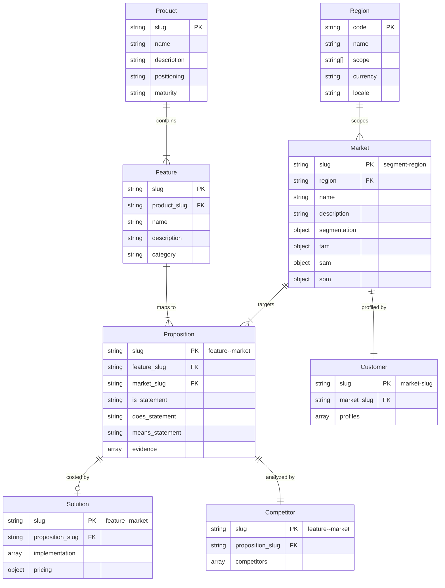

# cogni-portfolio Data Model Reference

## Entity Schemas

### portfolio.json (Project Root)

```json
{
  "slug": "project-slug",
  "company": {
    "name": "Company Name",
    "description": "What the company does",
    "industry": "Industry sector",
    "products": ["Product A", "Product B"]
  },
  "created": "2026-01-15",
  "updated": "2026-02-20"
}
```

Required fields: `slug`, `company.name`, `company.description`, `company.industry`

### products/{slug}.json

A product is a named offering that bundles related features. Every feature belongs to exactly one product.

```json
{
  "slug": "cloud-platform",
  "name": "Cloud Platform",
  "description": "Unified cloud infrastructure management platform for mid-market SaaS companies.",
  "positioning": "The most developer-friendly cloud management solution.",
  "pricing_tier": "Enterprise",
  "maturity": "growth",
  "launch_date": "2024-03-01",
  "version": "2.1",
  "created": "2026-01-15"
}
```

Required fields: `slug`, `name`, `description`
Optional fields: `positioning`, `pricing_tier`, `maturity`, `launch_date`, `version`, `source_file`, `created`

Valid `maturity` values: `concept`, `development`, `launch`, `growth`, `mature`, `decline`

### features/{slug}.json

A feature is market-independent. It describes what the product/service IS. Each feature belongs to exactly one product.

```json
{
  "slug": "cloud-monitoring",
  "product_slug": "cloud-platform",
  "name": "Cloud Infrastructure Monitoring",
  "description": "Real-time monitoring of cloud infrastructure including servers, containers, and network components with automated alerting.",
  "category": "observability",
  "created": "2026-01-15"
}
```

Required fields: `slug`, `product_slug`, `name`, `description`
Optional fields: `category`, `source_file`, `created`

### markets/{slug}.json

A target market defined by region, segmentation criteria, and sized by TAM/SAM/SOM. The slug encodes the segment and region: `{segment}-{region}` (e.g., `mid-market-saas-dach`).

```json
{
  "slug": "mid-market-saas-dach",
  "name": "Mid-Market SaaS Companies (DACH)",
  "region": "dach",
  "description": "SaaS companies with 50-500 employees and $5M-$100M ARR in DACH region.",
  "segmentation": {
    "company_size": "50-500 employees",
    "revenue_range": "$5M-$100M ARR",
    "vertical": "Software as a Service"
  },
  "tam": {
    "value": 5000000000,
    "currency": "EUR",
    "description": "Total addressable market for cloud monitoring in global SaaS",
    "source": "Gartner 2025 Cloud Monitoring Report"
  },
  "sam": {
    "value": 500000000,
    "currency": "EUR",
    "description": "Serviceable market in DACH mid-market SaaS",
    "source": "Internal estimate based on DACH SaaS census"
  },
  "som": {
    "value": 15000000,
    "currency": "EUR",
    "description": "Realistically obtainable share in first 3 years",
    "source": "Bottom-up estimate: 150 customers x 100K EUR ACV"
  },
  "created": "2026-01-15"
}
```

Required fields: `slug`, `name`, `region`, `description`
Optional fields: `segmentation`, `tam`, `sam`, `som`, `source_file`, `created`

The `region` field must be a valid region code from the standard taxonomy in `$CLAUDE_PLUGIN_ROOT/skills/setup/references/regions.json`. Valid codes: `de`, `dach`, `eu`, `uk`, `nordics`, `us`, `na`, `cn`, `apac`, `jp`, `latam`, `mea`, `global`.

The `segmentation` object captures non-geographic criteria (company size, revenue, vertical, etc.). Geographic scope is expressed solely through `region` -- do not duplicate it in `segmentation.geography`.

`source_file` (optional, all entity types): Filename of the document in `uploads/` from which this entity was extracted during ingestion.

### propositions/{feature-slug}--{market-slug}.json

A proposition maps one feature to one target market with market-specific messaging.

```json
{
  "slug": "cloud-monitoring--mid-market-saas",
  "feature_slug": "cloud-monitoring",
  "market_slug": "mid-market-saas",
  "is_statement": "Real-time cloud infrastructure monitoring with automated alerting for servers, containers, and network components.",
  "does_statement": "Reduces mean-time-to-resolution (MTTR) by 60% through intelligent alert correlation and root-cause analysis, eliminating alert fatigue that plagues growing engineering teams.",
  "means_statement": "Mid-market SaaS companies maintain 99.95% uptime SLAs without hiring additional SRE staff, protecting revenue and customer trust during rapid scaling phases.",
  "evidence": [
    {
      "statement": "Average MTTR reduction of 58% across beta customers (n=12)",
      "source_url": "https://example.com/case-study",
      "source_title": "Cloud Monitoring Case Study 2025"
    },
    {
      "statement": "3 of 5 mid-market SaaS customers eliminated dedicated on-call rotation",
      "source_url": null,
      "source_title": null
    }
  ],
  "created": "2026-01-20"
}
```

Required fields: `slug`, `feature_slug`, `market_slug`, `is_statement`, `does_statement`, `means_statement`
Optional fields: `evidence`, `created`

Each evidence entry can be a structured object with `statement` (string, required), `source_url` (string or null), and `source_title` (string or null). When web research produces evidence, include the source URL for claim verification. Entries without a source use null for URL/title fields.

**Naming convention**: Proposition file names use double-dash (`--`) to join feature and market slugs: `{feature-slug}--{market-slug}.json`

### solutions/{feature-slug}--{market-slug}.json

A solution attaches an implementation plan and pricing tiers to a proposition (same slug). It provides the commercial grounding for customer business cases.

```json
{
  "slug": "cloud-monitoring--mid-market-saas",
  "proposition_slug": "cloud-monitoring--mid-market-saas",
  "implementation": [
    {
      "phase": "Discovery & Setup",
      "duration_weeks": 2,
      "description": "Requirements gathering, environment audit, monitoring strategy definition"
    },
    {
      "phase": "Core Deployment",
      "duration_weeks": 4,
      "description": "Agent rollout, alerting rules, dashboard configuration, integration with existing tools"
    },
    {
      "phase": "Tuning & Handover",
      "duration_weeks": 2,
      "description": "Alert threshold optimization, team training, runbook documentation"
    }
  ],
  "pricing": {
    "proof_of_value": {
      "price": 15000,
      "currency": "EUR",
      "scope": "Single environment, 2-week guided pilot with defined success criteria"
    },
    "small": {
      "price": 50000,
      "currency": "EUR",
      "scope": "Up to 50 nodes, basic alerting, 8-week implementation"
    },
    "medium": {
      "price": 120000,
      "currency": "EUR",
      "scope": "Up to 200 nodes, advanced alerting and dashboards, 12-week implementation"
    },
    "large": {
      "price": 250000,
      "currency": "EUR",
      "scope": "Unlimited nodes, full observability stack, 16-week implementation with dedicated CSM"
    }
  },
  "created": "2026-03-05"
}
```

Required fields: `slug`, `proposition_slug`, `implementation` (array with at least one phase entry), `pricing` (object with `proof_of_value`, `small`, `medium`, `large` tiers)
Optional fields: `created`

Each implementation phase has `phase` (string, required), `duration_weeks` (number, required), and `description` (string, required). Each pricing tier has `price` (number, required), `currency` (string, required), and `scope` (string, required).

**Naming convention**: Solution file names use the same double-dash (`--`) convention as propositions: `{feature-slug}--{market-slug}.json`

### competitors/{feature-slug}--{market-slug}.json

Competitive landscape for a specific proposition (same slug as the proposition it analyzes).

```json
{
  "slug": "cloud-monitoring--mid-market-saas",
  "proposition_slug": "cloud-monitoring--mid-market-saas",
  "competitors": [
    {
      "name": "Datadog",
      "source_url": "https://example.com/datadog-review",
      "positioning": "Full-stack observability platform for cloud-scale companies",
      "strengths": ["Brand recognition", "Broad integration ecosystem", "APM + logs + metrics unified"],
      "weaknesses": ["Expensive at scale", "Complexity overkill for mid-market", "Opaque pricing"],
      "differentiation": "Our focused monitoring approach costs 40% less and deploys in hours vs. weeks, purpose-built for mid-market operational complexity."
    }
  ],
  "created": "2026-01-25"
}
```

Required fields: `slug`, `proposition_slug`, `competitors` (array with at least `name`)
Optional fields: `created`

Each competitor entry may include `source_url` (string or null) pointing to the primary research source used for positioning and pricing claims. This enables downstream claim verification.

### customers/{market-slug}.json

Ideal customer profile for a target market (same slug as the market).

```json
{
  "slug": "mid-market-saas",
  "market_slug": "mid-market-saas",
  "profiles": [
    {
      "role": "VP Engineering",
      "seniority": "C-1",
      "pain_points": [
        "Growing infrastructure complexity outpacing team capacity",
        "Alert fatigue leading to missed critical incidents",
        "Pressure to maintain SLAs with flat headcount"
      ],
      "buying_criteria": [
        "Time to value under 2 weeks",
        "Total cost under $100K/year",
        "Minimal configuration overhead"
      ],
      "information_sources": ["Hacker News", "Infrastructure podcasts", "Peer recommendations"],
      "decision_role": "Economic buyer and technical evaluator"
    }
  ],
  "created": "2026-01-25"
}
```

Required fields: `slug`, `market_slug`, `profiles` (array with at least `role`)
Optional fields: `created`

## Naming Conventions

| Convention | Rule | Example |
|---|---|---|
| Project slug | kebab-case, descriptive | `acme-cloud-services` |
| Product slug | kebab-case, product name | `cloud-platform` |
| Feature slug | kebab-case, noun-based | `cloud-monitoring` |
| Market slug | `{segment}-{region}` | `mid-market-saas-dach` |
| Proposition slug | `{feature}--{market}` | `cloud-monitoring--mid-market-saas-dach` |
| Solution slug | Same as proposition slug | `cloud-monitoring--mid-market-saas-dach` |
| Competitor slug | Same as proposition slug | `cloud-monitoring--mid-market-saas-dach` |
| Customer slug | Same as market slug | `mid-market-saas-dach` |

## Entity Relationships



- One product contains many features (1:N exclusive)
- One region scopes many markets (1:N)
- One feature can map to many markets (producing many propositions)
- One market can receive many features (producing many propositions)
- Each proposition has at most one solution (implementation plan + pricing)
- Each proposition has exactly one competitor analysis
- Each market has exactly one customer profile
- Region is defined in the taxonomy (`regions.json`), not as a project entity
- Features reference their parent product by `product_slug`
- Markets reference their region by `region` code
- Propositions, solutions, competitors, and customers reference their parents by slug
